# Platform Game

<!-- TABLE OF CONTENTS -->
<h2 id="table-of-contents">Contents</h2>
  <ol>
    <li><a href="#start"> ➤ Game Start</a></li>
    <li><a href="#level"> ➤ Level Selection</a></li>
    <li><a href="#basic"> ➤ Basic Settings</a></li>
    <li><a href="#features"> ➤ Features</a></li>
  </ol>
 

<h2 id="start"> 1. Game Start</h2>

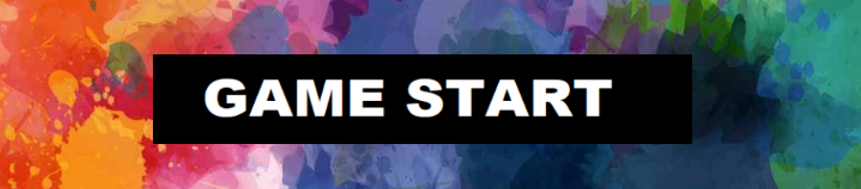

 

<h2 id="level"> 2. Level Selection</h2>

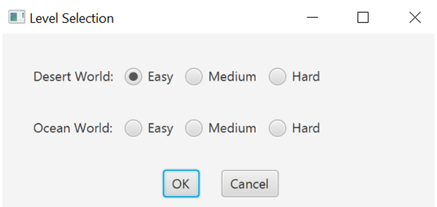

<li> Different Worlds </li> 
  
| Desert | Ocean |
|:----------:|:----------:|
| 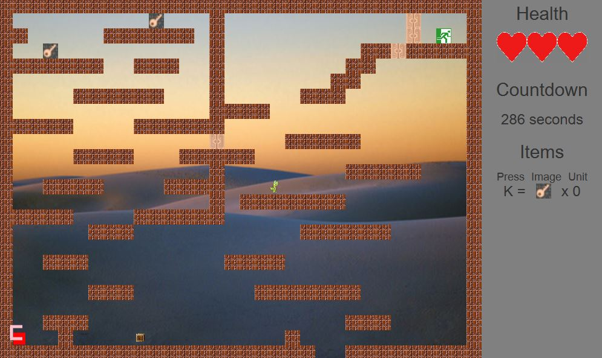 | 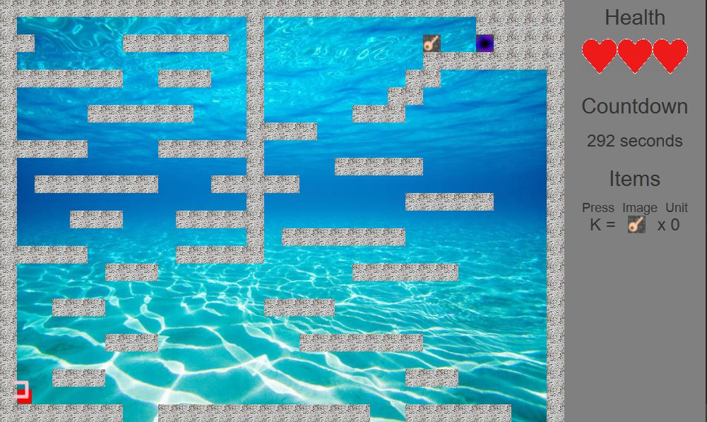 |

 

<h2 id="basic"> 3. Basic Settings</h2>
 

| Move | Win |
|:----------:|:----------:|
| 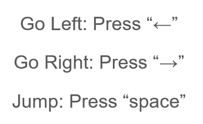 | 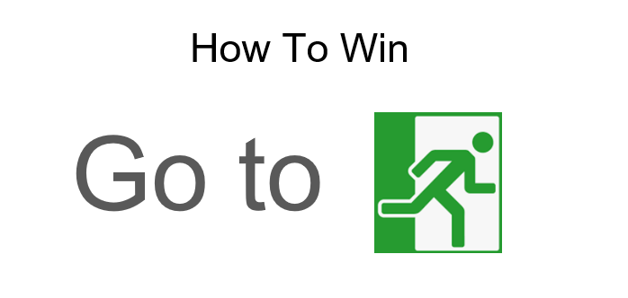 |

| Fail | Health |
|:----------:|:----------:|
| 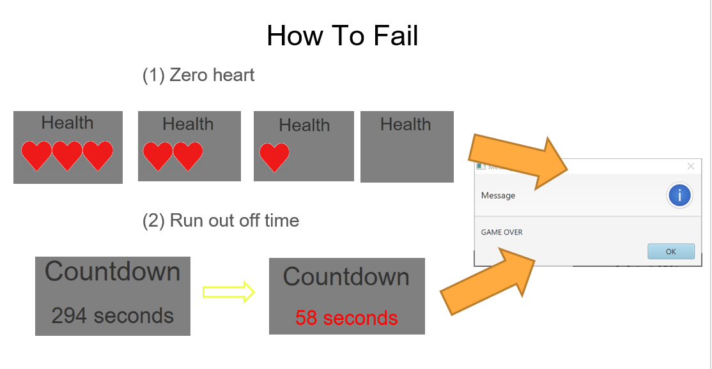 | 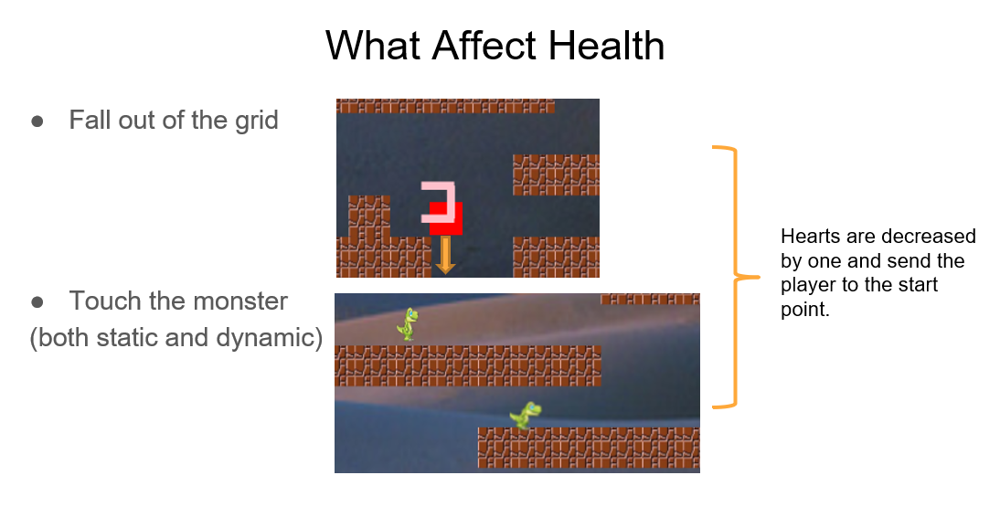 |

 

<h2 id="features"> 4. Features</h2>
 

| Pick up the keys | Open the doors |
|:----------:|:----------:|
| 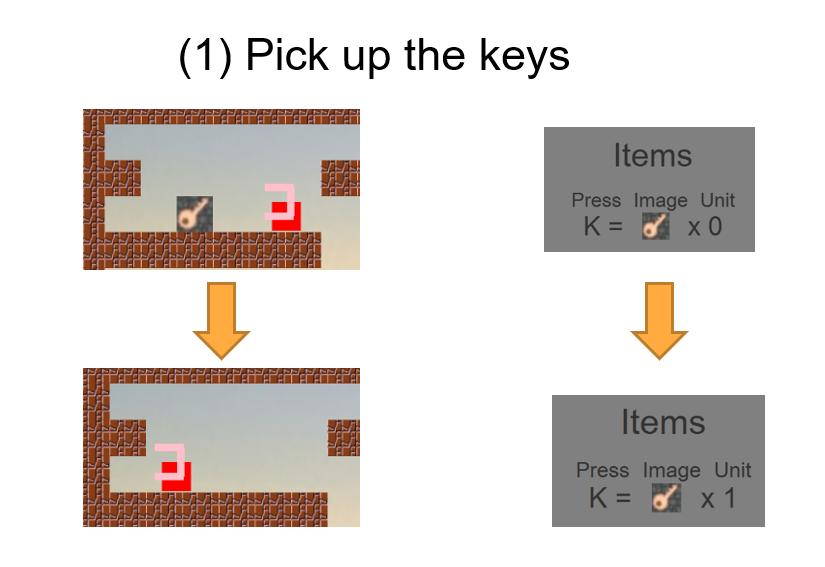 | 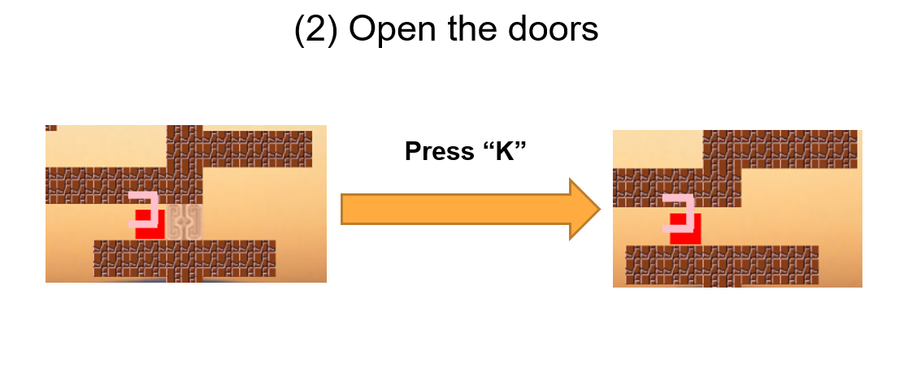 |

| Trap | 
|:----------:|
| 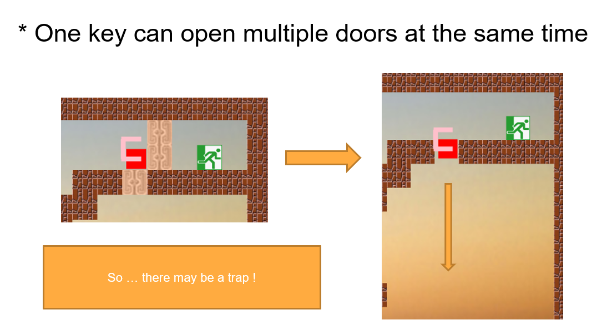 | 

| Portal | Move the boxes |
|:----------:|:----------:|
| 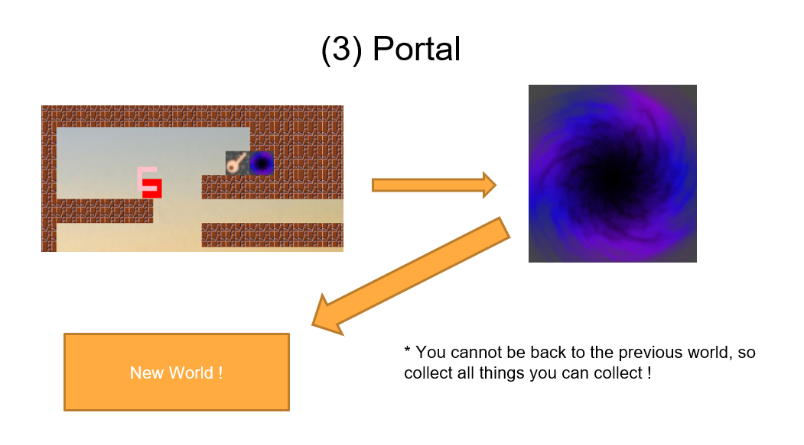 | 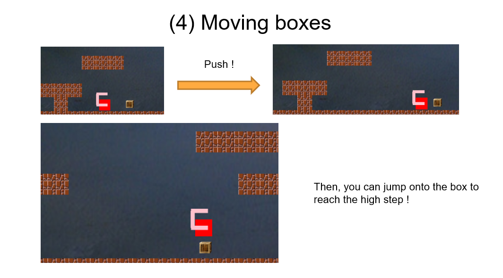 |
 
 
